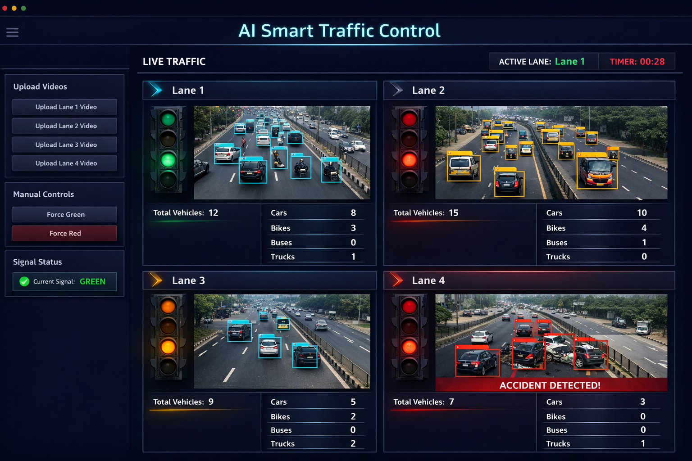
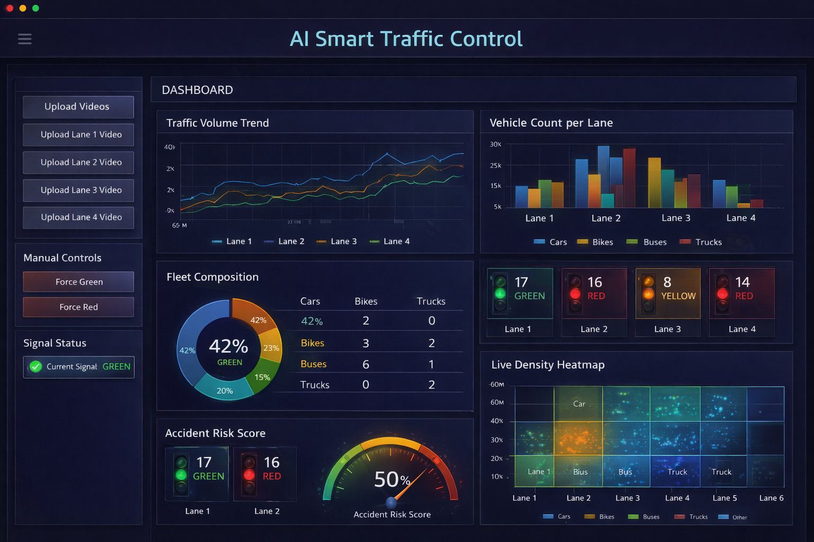
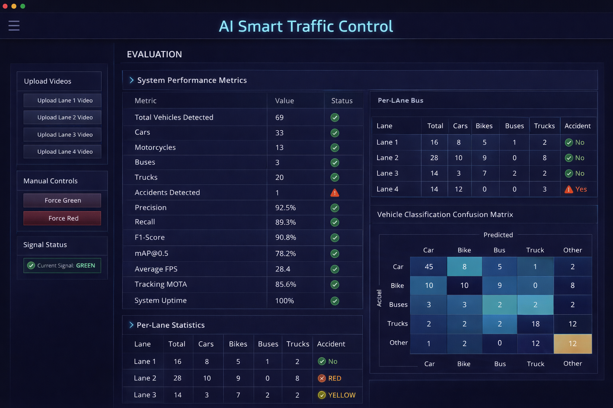

# AI Smart Traffic Control System

A Streamlit-based traffic management dashboard for multi-lane vehicle monitoring, adaptive signal timing, and live analytics using YOLOv8 + SORT tracking.

## Overview

This project simulates an AI-assisted traffic junction with four lanes. Each lane can load a separate video feed, detect vehicles in real time, estimate congestion, and participate in adaptive signal switching based on density.

The app includes:

- Live 2x2 traffic monitoring for four lanes
- YOLOv8 vehicle detection for cars, motorcycles, buses, and trucks
- SORT-based multi-object tracking
- Adaptive green-light timing based on live traffic density
- Accident-risk alerting when congestion crosses a threshold
- Dashboard analytics with Plotly charts
- Evaluation tables and a demo confusion matrix

## Screenshots

Illustrative UI previews styled to match the current application layout.

### Live Traffic View



### Analytics Dashboard



### Evaluation Tab



## Features

- Four independent lane inputs with per-lane upload controls
- Real-time signal visualization with GREEN, YELLOW, and RED states
- Automatic lane switching with dynamic green duration
- Vehicle count cards for each lane
- Live dashboard charts for trends, fleet mix, load, risk, and density
- Manual controls for next lane, all red, and green reset
- Demo mode fallback when the detection model is unavailable

## Tech Stack

- Streamlit
- Ultralytics YOLOv8
- OpenCV
- NumPy
- Pandas
- Plotly

## Project Structure

```text
traffic_system/
|-- app.py                     # Main Streamlit application
|-- app_2x2.py                # Alternate app variant
|-- lane.py                   # Lane processing, tracking, and video control
|-- dashboard.py              # Plotly dashboard charts
|-- evaluator.py              # Evaluation tables and confusion matrix
|-- sort.py                   # SORT tracker implementation
|-- config.py                 # Timing and detection settings
|-- utils.py                  # Utility helpers
|-- requirements.txt          # Python dependencies
|-- packages.txt              # Linux system package for Streamlit Cloud/OpenCV
|-- yolov8n.pt                # YOLO model weights
|-- docs/screenshots/         # README preview images
`-- Video/                    # Sample media assets
```

## Quick Start

### 1. Install dependencies

```bash
pip install -r requirements.txt
```

### 2. Run the app

```bash
streamlit run app.py
```

### 3. Use the interface

1. Upload one video for each lane in the sidebar.
2. Click `Load Videos`.
3. Watch the system rotate signals automatically based on detected traffic.
4. Open the `Dashboard` and `Evaluation` tabs for analytics.

## Signal Timing Logic

| Signal | Behavior |
|--------|----------|
| GREEN | `MIN_GREEN + vehicle_count * 0.6`, capped by `MAX_GREEN` |
| YELLOW | Fixed transition period using `YELLOW_TIME` |
| RED | Active while another lane has priority |

Current defaults from [`config.py`](config.py):

- `MIN_GREEN = 5`
- `MAX_GREEN = 30`
- `YELLOW_TIME = 2.0`

## Supported Detection Classes

- Car
- Motorcycle
- Bus
- Truck

## Deployment Notes

- For Streamlit Community Cloud, keep `packages.txt` committed so OpenCV can load correctly in Linux containers.
- If `yolov8n.pt` is missing, Ultralytics can re-download the model on first run.
- If model loading fails, the UI still runs in demo mode without live detection.

## Future Improvements

- Export analytics and session history
- Add configurable lane counts and layouts
- Replace demo evaluation metrics with real benchmark outputs
- Add persistent storage for uploaded sessions

## License

This project is intended for academic and demonstration use unless you add your own license terms.
